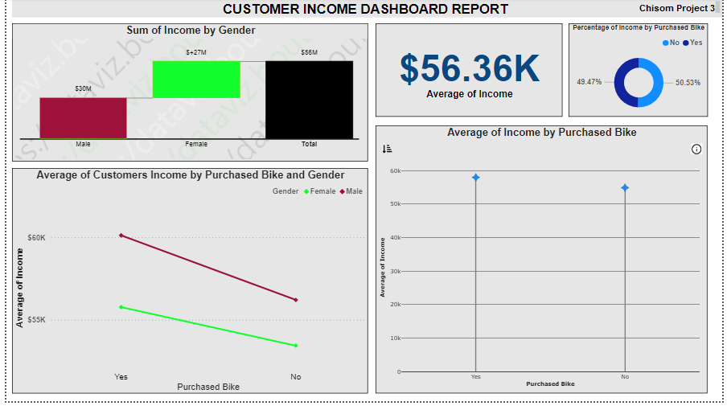
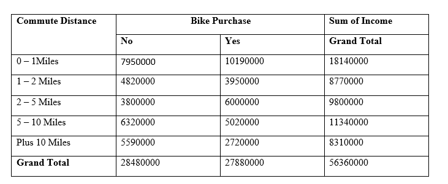

# Business-Analysis-of-Bike-Sales-using-Excel-and-Power-BI-software

## Introduction:

In this Portfolio, I have executed data cleaning, data analysis, and data visualization on this orchestrated data set using **Excel** and **Power BI** to extract information and draw some business insight on customers' financial behavior towards Bike purchases. I have used the information to answer some questions evaluating factors influencing customers' financial will to purchase a bicycle (bike). The data set is also evaluated in a disaggregated form with respect to gender, age bracket, region and more.

**_Disclaimer:_** This is an orchestrated data set used to showcase the joint use of **Excel** and **Power BI** in extracting Business insight.

**Data:** The original raw data used in this portfolio can be accessed with this link [here](https://github.com/Great-Chisom/Business-Analysis-of-Bike-Sales-using-Excel-and-Power-BI-software/blob/main/Excel%20Project%20RAW%20Dataset.xlsx)

## Step 1: Data Cleaning

Before using the data to draw insights, I had to clean the data set to prepare it for data analysis. 
In order to do this, I imported the data set into my worksheet in **Excel**, then I began the cleaning process by removing duplicates in the dataset using the **Remove Duplicates** tool in the **Data tab** option.
Next, I checked if the new data set had blank cell(s) by selecting the whole table and executing the syntax below:

          = COUNTBLANK (A1:M1001)

When I was certain of no blank cell, next I redress some columns in the tables, such as:

- In the Marital Status column (column B), I replaced the ‘M’ string with ‘Married’, and the ‘S’ string with ‘Single’, for proper understanding.

- In the Gender column (column C), I replaced the ‘F’ string with ‘Female’, and the ‘M’ string with ‘Male’, for proper understanding.

I did the above changes using the **Find and Replace** tool in the **Home tab** option.

- Also, I removed the two decimal place value status from all the income values in the Income column (column D). This change was executed using the **decimal** tool option in the **Home tab**, under the **Number** section.

- I created a new column called **Age Brackets** with a defined age range, for better analysis.  And the age range grouping was done using the Nested IF syntax below;

        = IF (L2<31, “Adolescent”, IF( L2 >= 54, “Old”, IF(L2 >= 31, “Middle Age” )))
      
And the above syntax was applied across all cells with reference to column L, in column M. And below is a preview of the Data set cleaned table, which the whole table can be accessed with this link [here](https://github.com/Great-Chisom/Business-Analysis-of-Bike-Sales-using-Excel-and-Power-BI-software/blob/main/Excel%20Project%20Cleaned%20Dataset.xlsx)

**Title:** Dataset Table Preview

## Step 2: Data Analysis and Visualization:

Here, I did several data analysis and visualization to draw business insight from the cleaned data set, while answering some defined questions.
I often used the **Pivot table** tool to give a statistical summary report in view of the information I was extracting. The **Pivot table** tool was accessed through the **Insert tab**. Also, **Correlation** and **Regression** analysis was conducted, and these tools were accessed through the **Data Analysis** tool options in the **Data tab**. And I did all of the data visualization dashboards using **Microsoft Power BI** software. I exported the cleaned data into **Power BI** and used the software for visualization, and this visualization aided in drawing insights and making recommendations.

## Task 1: 

Here, I looked at the Income of persons that both bought and did not buy a bike. 

**Title:** Pivot Table Report 1

**Title:** Customer Income Dashboard Report

**Remark:** The Reports above reveals that customers who did not buy bikes have lower income when compared to customers that purchased bike. And also, with the gender-disaggregated dataset, the report shows that women made less income on average than their men counterparts. 

## Task 2: 

Here, I looked at how customers' commute distance affected their purchasing will for bikes.

**Title:** Pivot Table Report 1

**Title:** Commute Distance Dashboard Report 

**Remark:** The Report shows that customers' demand for bikes decreased with an increase in commute distance. And the report also reveals that customers with more commute distance make less income, which implies that the commute distance is inversely proportional to customers' income.

## Task 3:

Here, I looked at how the Age of customers influenced their desire to purchase bike (bicycle).

**Title:** Pivot Table Report 2

**Title:** Pivot table Report 3 

**Title:** Customer Age Distribution Dashboard Report

**Remark:** The Report above shows that customers under the age of 31 have low purchase will, which ranks next to customers above 54 years of age. However, Middle age customers between the age of 31 and 53 buy a lot of bike(s). The Report further reveals that customers between the age of 31 and 53 make more income than customers above the age of 54, and customers below the age of 31. This can be attributed to the case that people between the age of 31 and 53 make up the majority range of workforce and working persons in the countries. And this is a pointer to the sales and marketing department of the organization.

## Task 4:

Here, I looked at how the marital status of customers influenced their purchasing will

**Title:** Pivot Table Report 4 

**Title:** Customer Marital Status Impact Factor Report

**Remark:** The Report above shows that married customers purchased more bikes than single customers. And so is answered with the pivot table report, which revealed that married customers made more income than single customers.

## Task 5:

Here, I looked at the relationship between customer's number of owned cars, and their purchase will for bikes.

**Title:** Pivot Table Report 5

**Title:** Correlation Analysis

**Title:** Regression Report 

**Remark:** The Report above shows that customer's increase in number of cars gives an inverse proportionality to their purchase of bikes. And this statement is supported by the negative correlation value – 0.72 between the two variables, which is the same as the **Multiple R** value indicating a strong inverse relationship, and the large **Standard Error** value indicates a distant fitness between the values of the variables. 

## Task 6

Here, I looked at the customer's purchase will with respect to the region

**Title:** Bike Sales According to Region

**Remark:** The above Report reveals that customers in North America purchased more bikes, followed by customers in Europe, and next in line are customers in the Pacific region. And this financial behavior is attributed to the fact that customers in North America earned more income, followed by customers in Europe, and next in earning is customers in the Pacific region.

## Task 7

Here, I looked at the customer's purchase will with respect to their educational status

**Title:** Customers Education Status distribution

**Remark:** The Report above shows that customers who attended higher institutions tend to earn more money, and these attributes positively influence their purchasing power and will for bikes.

## Task 8

Here, I looked at customers with children, if the number4 of children did influence their purchase will for bike(s)

**Title:** Number of Children Impact Factor Report

**Remark:** The Report above reveals that, on average, customers with more children earn more, however, the customer's number of children has little to no impact on the customer's will to purchase bikes.

## Task 9

Here, I looked at customers who owned a home, and if it influenced the purchase will of bikes. 
To do this, I had to edit the **Home Owner** column values using the **Power Query Editor** tool in **Power BI**. I replaced ‘Yes’ string with ‘Home Owner’ string, and ‘No’ string with ‘Non Homer Owner’ string, this aid in differentiating data analysis between the **Hom Status** analysis and **Purchase Bike** analysis. I used the **Replace value** tool option in the **Home tab** available in the **Power Query Editor**.

Title: Customers Housing Status Impact Factor Report

**Remark:** The Report above shows that customers that owns a home earn more money than customers that do not own a home, and this gives them the financial strength to purchase a bike. However, the Report also shows that Non-Home owners tends to demand more quantity of bikes than Home owners. This implies even with the low financial strength of customers that do not own a home, this particular customers gives less objections to purchase of bike(s). 

## Conclusion and Recommendation:

From the Dataset above, the Report showed that customer’s income level influenced their purchasing power for bike(s), and commute distance influenced customers demand for bike(s). And from the Report it is recommended that sales of bike(s) should be focused for persons between the middle age, and persons who live in North America and Europe. In addition, the Report revealed that customers without homes tend to purchase more quantities of bike(s).
This conclusion would aid the sales and marketing department staff to strategize their salesforce execution.

## Appreciation:

Thank you for reading through, and feel free to drop a comment or suggestions, and click here to access the interactive Power BI dashboard [here](https://app.powerbi.com/groups/me/reports/1b085c55-638d-423a-b63d-e5365af070cf/ReportSection77e391d937c4d352bd54?experience=power-bi)

 
 
